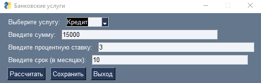
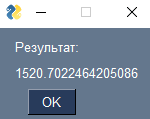
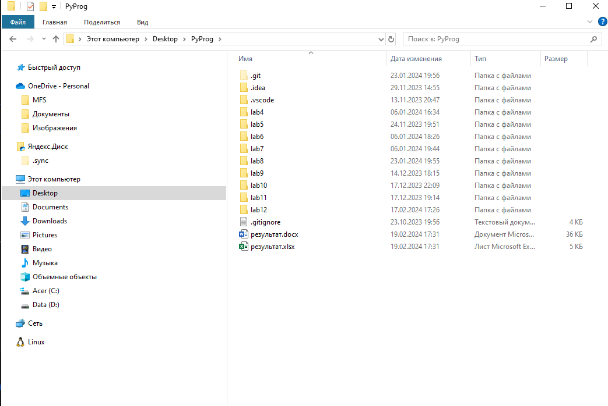
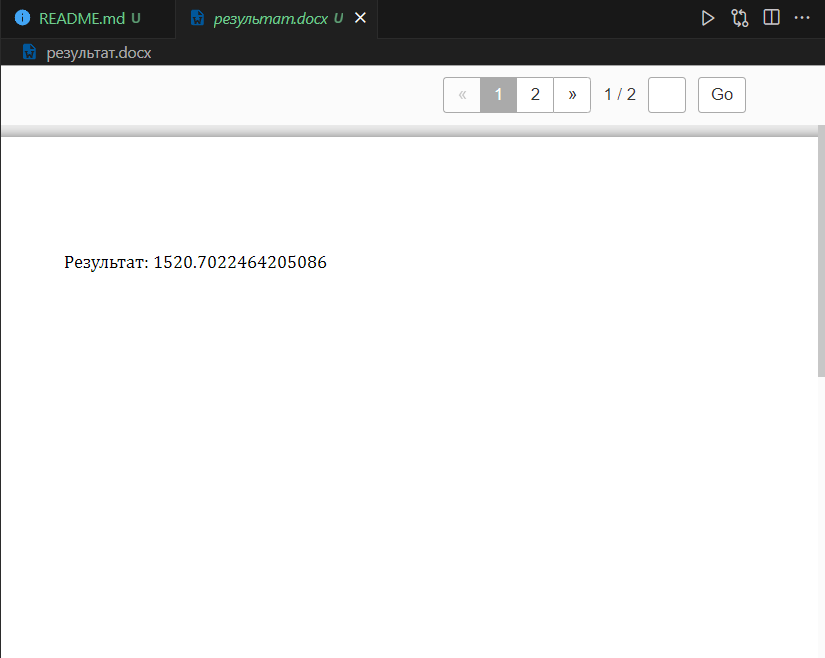
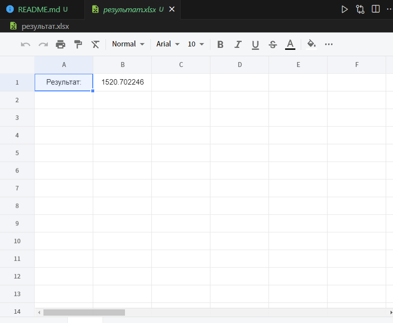

# lab 12
# PyProg

# Задание
Сложность: Rare

    По своему варианту задания и GUI фреймворка создайте пакет, содержащий 3 модуля, и подключите его к основной программе. Основная программа должна предоставлять:

    графический пользовательский интерфейс с возможностями ввода требуемых параметров и отображения результатов расчёта,
    возможность сохранить результаты в отчёт формата .doc или .xls (например, пакеты python-docx и openpyxl).

# Код 
```python
import PySimpleGUI as sg
from docx import Document
from openpyxl import Workbook
from bank_services import calculate_credit, calculate_installment, calculate_deposit

def save_to_doc(result):
    doc = Document()
    doc.add_paragraph(f'Результат: {result}')
    doc.save('результат.docx')

def save_to_xls(result):
    wb = Workbook()
    ws = wb.active
    ws['A1'] = 'Результат:'
    ws['B1'] = result
    wb.save('результат.xlsx')

layout = [
    [sg.Text('Выберите услугу:'), sg.Combo(['Кредит', 'Рассрочка', 'Вклад'], key='-SERVICE-')],
    [sg.Text('Введите сумму:'), sg.Input(key='-AMOUNT-')],
    [sg.Text('Введите процентную ставку:'), sg.Input(key='-RATE-')],
    [sg.Text('Введите срок (в месяцах):'), sg.Input(key='-TERM-')],
    [sg.Button('Рассчитать'), sg.Button('Сохранить'), sg.Button('Выход')]
]

window = sg.Window('Банковские услуги', layout)
result = None

while True:
    event, values = window.read()
    if event == sg.WINDOW_CLOSED or event == 'Выход':
        break
    elif event == 'Рассчитать':
        if values['-SERVICE-'] == 'Кредит':
            result = calculate_credit(float(values['-AMOUNT-']), float(values['-RATE-']), int(values['-TERM-']))
        elif values['-SERVICE-'] == 'Рассрочка':
            result = calculate_installment(float(values['-AMOUNT-']), float(values['-RATE-']), int(values['-TERM-']))
        elif values['-SERVICE-'] == 'Вклад':
            result = calculate_deposit(float(values['-AMOUNT-']), float(values['-RATE-']), int(values['-TERM-']))
        sg.popup('Результат: ', result)
    elif event == 'Сохранить':
        if result is not None:
            save_to_doc(result)
            save_to_xls(result)
            sg.popup('Результат сохранен.')
        else:
            sg.popup('Рассчитайте результаты перед сохранением.')

window.close()
```

# Результат

`Ввод данных`


`Ответ`


`Сохраняем`


`В ворде`


`В экселе`