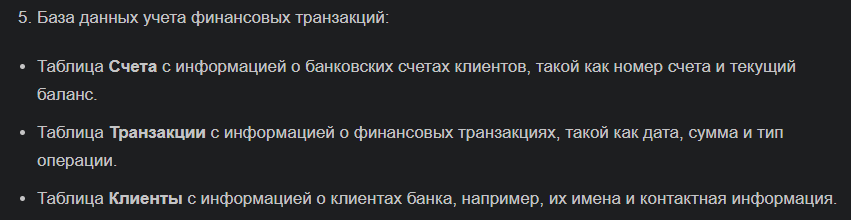
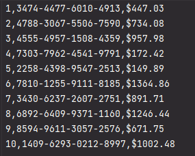
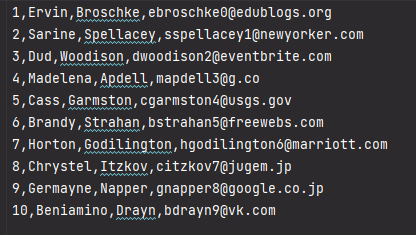
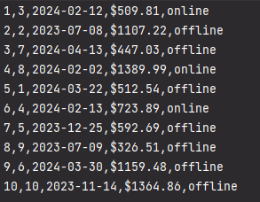
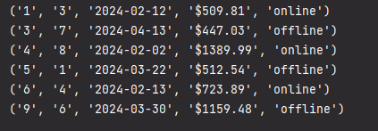
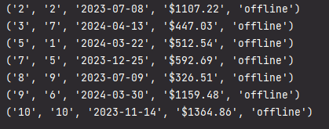
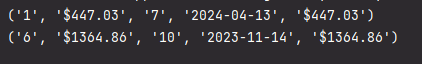

## Прог. Лабораторная работа №14
### Задание:
1. Спроектировать БД с использованием crow's foot notation.
2. Создать таблицы БД и заполнить данными
3. Написать несколько запросов для выборки данных из всех таблиц
4. Оформить отчет ```README.md```, который должен содержать:
    - условия задач
    - описание проделанной работы
    - скриншоты результатов
    - ссылки на используемые материалы

### Ход работы:
Мой вариант:    


1. Спроектированная с использованием crow's foot notation БД:   


2. Таблицы БД были созданы с помощью сервиса [Mockaroo](https://www.mockaroo.com/)   
   - Таблица `accounts`    
    
   - Таблица `clients`    
    
   - Таблица `transactions`     
    

3. Код:

```Python
import csv
import sqlite3

con = sqlite3.connect("my_database.db")
cur = con.cursor()

# создание таблиц
# cur.execute("CREATE TABLE accounts (account_id, account_number, balance);")
# cur.execute("CREATE TABLE clients (client_id, first_name, last_name, email);")
# cur.execute("CREATE TABLE transactions (transaction_id, client_id, date, amount, operation_type);")

file1 = open('accounts.csv')
file2 = open('clients.csv')
file3 = open('transactions.csv')

contents1 = csv.reader(file1)
contents2 = csv.reader(file2)
contents3 = csv.reader(file3)

# расположение данных в таблицах
# insert_records = "INSERT INTO accounts (account_id, account_number, balance) VALUES(?, ?, ?)"
# cur.executemany(insert_records, contents1)
#
# insert_records = "INSERT INTO clients (client_id, first_name, last_name, email) VALUES(?, ?, ?, ?)"
# cur.executemany(insert_records, contents2)
#
# insert_records = "INSERT INTO transactions (transaction_id, client_id, date, amount, operation_type) VALUES(?, ?, ?, ?, ?)"
# cur.executemany(insert_records, contents3)

# установление связей между таблицами
cur.execute('SELECT clients.client_id FROM clients JOIN accounts ON (clients.client_id = accounts.account_id)')
cur.execute('SELECT clients.client_id FROM clients JOIN transactions ON (clients.client_id = transactions.client_id)')

# запросы
select_all = "SELECT * FROM transactions WHERE transactions.date LIKE '%2024%'"
rows = cur.execute(select_all).fetchall()

# select_all = "SELECT * FROM transactions WHERE transactions.operation_type = 'offline'"
# rows = cur.execute(select_all).fetchall()

# select_all = "SELECT account_id, balance, client_id, date, amount FROM transactions, accounts WHERE transactions.amount = accounts.balance"
# rows = cur.execute(select_all).fetchall()

# select_all = 'SELECT * FROM clients'
# rows = cur.execute(select_all).fetchall()

for r in rows:
    print(r)

con.commit()
con.close()
```
Выполнение запросов:

"Выбрать все строки из transactions, если транзакция осуществлялась в 2024 году"
```Python
select_all = "SELECT * FROM transactions WHERE transactions.date LIKE '%2024%'"
rows = cur.execute(select_all).fetchall()
```
Вывод:    


"Выбрать все из transactions, если тип транзакции "offline""
```Python
select_all = "SELECT * FROM transactions WHERE transactions.operation_type = 'offline'"
rows = cur.execute(select_all).fetchall()
```

Вывод:     


"Выбрать все строки из clients"
```Python
select_all = 'SELECT * FROM clients'
rows = cur.execute(select_all).fetchall()
```
Вывод:    


"Выбрать account_id, balance, client_id, date, amount из transactions и accounts, если сумма транзакции равна балансу какого-либо аккаунта"
```Python
select_all = "SELECT account_id, balance, client_id, date, amount FROM transactions, accounts WHERE transactions.amount = accounts.balance"
rows = cur.execute(select_all).fetchall()
```

Вывод:    

