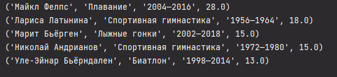

## Прог. Лабораторная работа №15

### Задание
1. Спроектировать БД с использованием crow's foot notation.
2. Реализовать парсер для сбора данных с веб-страницы.
3. С помощью DB API создать таблицы БД и заполнить их данными, полученными с помощью парсера.
4. Написать запросы для выборки данных из БД.
5. Оформить отчет ```README.md```, который должен содержать:
    - условия задач
    - описание проделанной работы
    - скриншоты результатов
    - ссылки на используемые материалы

### Ход работы:
Мой вариант:    


1. Спроектированное с использованием crow's foot notation БД    

2. Код:   
```Python
import csv
import sqlite3
import pandas as pd

# # # Парсинг таблиц с сайта
# table1 = pd.read_html('https://ru.wikipedia.org/wiki/%D0%A1%D0%BF%D0%B8%D1%81%D0%BE%D0%BA_%D0%BC%D0%BD%D0%BE%D0%B3%D0%BE%D0%BA%D1%80%D0%B0%D1%82%D0%BD%D1%8B%D1%85_%D1%87%D0%B5%D0%BC%D0%BF%D0%B8%D0%BE%D0%BD%D0%BE%D0%B2_%D0%9E%D0%BB%D0%B8%D0%BC%D0%BF%D0%B8%D0%B9%D1%81%D0%BA%D0%B8%D1%85_%D0%B8%D0%B3%D1%80',
#                       match='Спортсмен')
# table2 = pd.read_html('https://ru.wikipedia.org/wiki/%D0%A1%D0%BF%D0%B8%D1%81%D0%BE%D0%BA_%D0%BC%D0%BD%D0%BE%D0%B3%D0%BE%D0%BA%D1%80%D0%B0%D1%82%D0%BD%D1%8B%D1%85_%D1%87%D0%B5%D0%BC%D0%BF%D0%B8%D0%BE%D0%BD%D0%BE%D0%B2_%D0%9E%D0%BB%D0%B8%D0%BC%D0%BF%D0%B8%D0%B9%D1%81%D0%BA%D0%B8%D1%85_%D0%B8%D0%B3%D1%80',
#                       match='Спортсмен')
# table3 = pd.read_html('https://ru.wikipedia.org/wiki/%D0%A1%D0%BF%D0%B8%D1%81%D0%BE%D0%BA_%D0%BC%D0%BD%D0%BE%D0%B3%D0%BE%D0%BA%D1%80%D0%B0%D1%82%D0%BD%D1%8B%D1%85_%D1%87%D0%B5%D0%BC%D0%BF%D0%B8%D0%BE%D0%BD%D0%BE%D0%B2_%D0%9E%D0%BB%D0%B8%D0%BC%D0%BF%D0%B8%D0%B9%D1%81%D0%BA%D0%B8%D1%85_%D0%B8%D0%B3%D1%80',
#                       match='Спортсмен')
#
# # Удаление лишних столбцов из таблицы "спортсмены"
# df1 = table1[0]
# df1.drop(['№'], axis=1, inplace=True)
#
# # Удаление лишних столбцов из таблицы "страны"
# df2 = table2[0]
# df2.drop(['№', 'Спортсмен', 'Игры', "Unnamed: 5", 'Unnamed: 6', 'Unnamed: 7'], axis=1, inplace=True)
#
# # Удаление лишних столбцов из таблицы "виды спорта"
# df3 = table3[0]
# df3.drop(['№', 'Спортсмен', 'Игры', "Unnamed: 5", 'Unnamed: 6', 'Unnamed: 7', 'Всего'], axis=1, inplace=True)

# # Сохранение таблиц в файлы .csv
# df1.to_csv('Sportsmen.csv')
# df2.to_csv('Countries.csv')
# df3.to_csv('Sports.csv')

# # Создание таблиц БД с помощью DB API
con = sqlite3.connect('my_db.db')
cur = con.cursor()

# cur.execute('CREATE TABLE Sportsmen (no, sportsman, country, sports, games, first_place REAL, second_place, third_place REAL, total_awards REAL)')
# cur.execute('CREATE TABLE Countries (no, country, sports, total_awards REAL)')
# cur.execute('CREATE TABLE Sports (no, country, sports)')

# file1 = open('Sportsmen.csv')
# file2 = open('Countries.csv')
# file3 = open('Sports.csv')
#
# contents1 = csv.reader(file1)
# contents2 = csv.reader(file2)
# contents3 = csv.reader(file3)

# Расположение данных в таблицах
# insert_records = 'INSERT INTO Sportsmen (no, sportsman, country, sports, games, first_place, second_place, third_place, total_awards) VALUES (?, ?, ?, ?, ?, ?, ?, ?, ?)'
# cur.executemany(insert_records, contents1)
#
# insert_records = 'INSERT INTO Countries (no, country, sports, total_awards) VALUES (?, ?, ?, ?)'
# cur.executemany(insert_records, contents2)
#
# insert_records = 'INSERT INTO Sports (no, country, sports) VALUES (?, ?, ?)'
# cur.executemany(insert_records, contents3)

# # запросы
# топ 5 спортсменов по числу медалей
# select_all = 'SELECT sportsman, sports, games, total_awards FROM Sportsmen ORDER BY total_awards DESC LIMIT 5'
# rows = cur.execute(select_all).fetchall()

# топ 5 стран по числу медалей
# select_all = 'SELECT country, total_awards FROM Countries ORDER BY total_awards DESC LIMIT 5'
# rows = cur.execute(select_all).fetchall()

# спортсмены с группировкой по странам
# select_all = 'SELECT country, COUNT(*) AS Sportsmen_group_by_countries FROM Sportsmen GROUP BY country'
# rows = cur.execute(select_all).fetchall()

# спортсмены с группировкой по видам спорта
select_all = 'SELECT sports, COUNT(*) AS Sportsmen_group_by_sports FROM Sportsmen GROUP BY sports'
rows = cur.execute(select_all).fetchall()

for r in rows:
    print(r)

con.commit()
con.close()
```

#### Выполнение запросов
```Python
# топ 5 спортсменов по числу медалей
select_all = 'SELECT sportsman, sports, games, total_awards FROM Sportsmen ORDER BY total_awards DESC LIMIT 5'
rows = cur.execute(select_all).fetchall()
```  

Вывод:    


```Python
# топ 5 стран по числу медалей
select_all = 'SELECT country, total_awards FROM Countries ORDER BY total_awards DESC LIMIT 5'
rows = cur.execute(select_all).fetchall()
```

Вывод:    


```Python
# спортсмены с группировкой по странам
select_all = 'SELECT country, COUNT(*) AS Sportsmen_group_by_countries FROM Sportsmen GROUP BY country'
rows = cur.execute(select_all).fetchall()
```

Вывод:    


```Python
# спортсмены с группировкой по видам спорта
select_all = 'SELECT sports, COUNT(*) AS Sportsmen_group_by_sports FROM Sportsmen GROUP BY sports'
rows = cur.execute(select_all).fetchall()
```

Вывод:    


