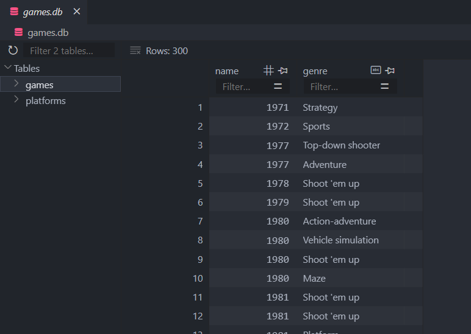
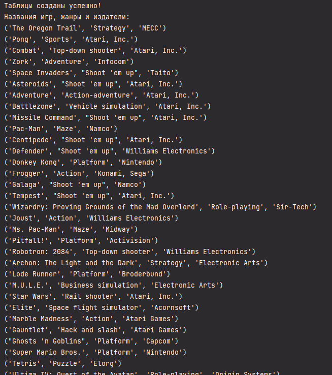
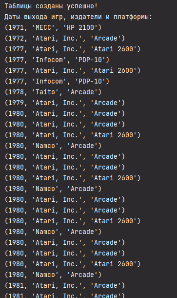
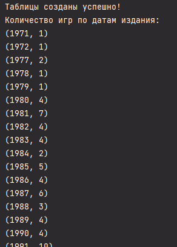

# Прог. Лабораторная работа №16
## Задание
1. Реализовать парсер с использованием Selenium для сбора данных с веб-страницы. Это может быть:
    - онлайн-каталог
    - интернет-магазин
    - энциклопедия и т.д.
2. Создать таблицы БД и заполнить их данными, полученными с помощью парсера.
3. Написать запросы для выборки данных из БД с использованием PyPika Queru Builder
    - 2 запроса с JOIN
    - 3 запроса с расчетом статистики/группировкой/агрегирующими функциями
4. Оформить отчет `README.md`

## Ход работы

Для парсинга была выбрана [страница из энциклопедии Wikipedia](https://en.wikipedia.org/wiki/List_of_video_games_considered_the_best).

Код:    
```Python
import pandas as pd
import wikipedia as wp
import sqlite3

# Получаем HTML-страницу из Википедии
html = wp.page("List_of_video_games_considered_the_best").html().encode("UTF-8")

try:
    df = pd.read_html(html)[1]  # Пытаемся получить вторую таблицу
except IndexError:
    df = pd.read_html(html)[0]  # Если второй таблицы нет, берем первую

# Берем первые 300 строк
df = df.iloc[:300, :]

# Создаем таблицы
games_df = df.iloc[:, [0, 1, 2]].rename(columns=lambda x: x.replace(']', '').replace('[', '').strip())  # Название и жанр
games_df.columns = ['date', 'name', 'genre']  # Переименовываем столбцы

platforms_df = df.iloc[:, [0, 1, 3, 4]].rename(columns=lambda x: x.replace(']', '').replace('[', '').strip())  # Название, издатель, платформа
platforms_df.columns = ['date', 'name', 'publisher', 'platform']  # Переименовываем столбцы

# Создаем соединение с базой данных SQLite
conn = sqlite3.connect("games.db")

# Создаем таблицы
games_df.to_sql("games", conn, if_exists="replace", index=False)
platforms_df.to_sql("platforms", conn, if_exists="replace", index=False)

# Закрываем соединение
conn.close()

print("Таблицы созданы успешно!")


from pypika import Query, Table, Case, functions as fn

# Подключение к базе данных
conn = sqlite3.connect("games.db")
cursor = conn.cursor()

games = Table("games")
platforms = Table("platforms")

# 1. Запрос с JOIN для получения названий игр, жанров и издателей
# query = (
#     Query.from_(games)
#     .join(platforms)
#     .on(games.name == platforms.name)
#     .select(games.name, games.genre, platforms.publisher)
# )
# cursor.execute(str(query))
# print("Названия игр, жанры и издатели:")
# for row in cursor.fetchall():
#     print(row)

# 2. Запрос с JOIN для получения даты издания и издателей и платформы
# query = (
#     Query.from_(games)
#     .join(platforms)
#     .on(games.date == platforms.date)
#     .select(games.date, platforms.publisher, platforms.platform)
# )
# cursor.execute(str(query))
# print("Даты выхода игр, издатели и платформы:")
# for row in cursor.fetchall():
#     print(row)

# 3. Запрос с группировкой и подсчетом количества игр для каждого жанра
# query = (
#     Query.from_(games)
#     .select(games.genre, fn.Count(games.name).as_("game_count"))
#     .groupby(games.genre)
# )
# cursor.execute(str(query))
# print("Количество игр по жанрам:")
# for row in cursor.fetchall():
#     print(row)

# 4. Группировка и подсчет по году издания
# query = (
#     Query.from_(games)
#     .select(games.date, fn.Count(games.date).as_("publication_date"))
#     .groupby(games.date)
# )
# cursor.execute(str(query))
# print("Количество игр по датам издания:")
# for row in cursor.fetchall():
#     print(row)

# 5. Группировка и подсчет по названию платформы, если название платформы содержит 'Game Boy'
query = (
    Query.from_(platforms)
    .select(platforms.platform, fn.Count(platforms.platform).as_("group_by_platforms"))
    .groupby(platforms.platform).where(platforms.platform.like('%Game Boy%'))
)
cursor.execute(str(query))
print("Группировка игр по названиям платформ:")
for row in cursor.fetchall():
    print(row)

# Закрытие соединения с базой данных
conn.close()
```

Получившиеся таблицы:   
    


## Выполнение запросов
```Python
# 1. Запрос с JOIN для получения названий игр, жанров и издателей
query = (
    Query.from_(games)
    .join(platforms)
    .on(games.name == platforms.name)
    .select(games.name, games.genre, platforms.publisher)
)
cursor.execute(str(query))
print("Названия игр, жанры и издатели:")
for row in cursor.fetchall():
    print(row)
```  

Вывод:    


```Python
# 2. Запрос с JOIN для получения даты издания и издателей и платформы
query = (
    Query.from_(games)
    .join(platforms)
    .on(games.date == platforms.date)
    .select(games.date, platforms.publisher, platforms.platform)
)
cursor.execute(str(query))
print("Даты выхода игр, издатели и платформы:")
for row in cursor.fetchall():
    print(row)
```

Вывод:    


```Python
# 3. Запрос с группировкой и подсчетом количества игр для каждого жанра
query = (
    Query.from_(games)
    .select(games.genre, fn.Count(games.name).as_("game_count"))
    .groupby(games.genre)
)
cursor.execute(str(query))
print("Количество игр по жанрам:")
for row in cursor.fetchall():
    print(row)
```

Вывод:    


```Python
# 4. Группировка и подсчет по году издания
query = (
    Query.from_(games)
    .select(games.date, fn.Count(games.date).as_("publication_date"))
    .groupby(games.date)
)
cursor.execute(str(query))
print("Количество игр по датам издания:")
for row in cursor.fetchall():
    print(row)
```

Вывод:    


```Python
# 5. Группировка и подсчет по названию платформы, если название платформы содержит 'Game Boy'
query = (
    Query.from_(platforms)
    .select(platforms.platform, fn.Count(platforms.platform).as_("group_by_platforms"))
    .groupby(platforms.platform).where(platforms.platform.like('%Game Boy%'))
)
cursor.execute(str(query))
print("Группировка игр по названиям платформ, если название платформы содержит 'Game Boy':")
for row in cursor.fetchall():
    print(row)
```

Вывод:    

