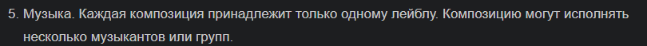
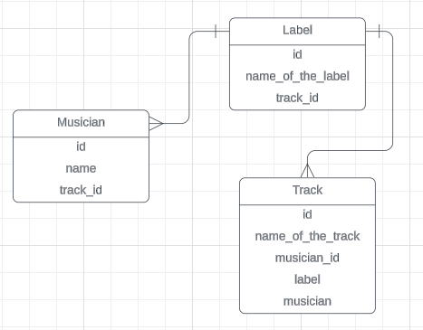
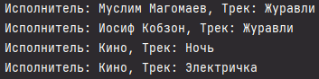
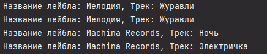
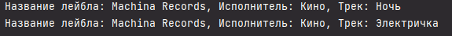

# Прог. Лабораторная работа №17
## Задание:
1. Спроектировать БД с использованием crow’s foot notation.
2. Написать модели данных, создать и заполнить БД с помощью SQLAlchemy.
3. Написать запросы для выборки и анализа данных из БД.
4. Оформить отчет в `readme.md`.

## Мой вариант


## Ход работы

Спроектированная при помощи crow’s foot notation БД:    



Модели данных, заполнение БД, запросы:  

````Python
from sqlalchemy import Column, Integer, String, ForeignKey
from sqlalchemy.orm import relationship, declarative_base
from sqlalchemy import create_engine
from sqlalchemy.orm import sessionmaker

Base = declarative_base()


class Musician(Base):
    __tablename__ = 'musicians'
    id = Column(Integer(), primary_key=True)
    name = Column(String())


class Track(Base):
    __tablename__ = 'tracks'
    id = Column(Integer(), primary_key=True)
    name_of_the_track = Column(String())


class Label(Base):
    __tablename__ = 'labels'
    id = Column(Integer(), primary_key=True)
    name_of_the_label = Column(String())
    track_id = Column(Integer(), ForeignKey('tracks.id'))
    track = relationship('Track')
    musician_id = Column(Integer(), ForeignKey('musicians.id'))
    musician = relationship('Musician')


# создание бд
engine = create_engine('sqlite:///music.db')
Base.metadata.create_all(engine)

Session = sessionmaker(bind=engine)
session = Session()

# Заполнение данными
track1 = Track(name_of_the_track='Журавли')
track2 = Track(name_of_the_track='Ночь')
track3 = Track(name_of_the_track='Электричка')

musician1 = Musician(name='Муслим Магомаев')
musician2 = Musician(name='Кино')
musician3 = Musician(name='Иосиф Кобзон')

label1 = Label(name_of_the_label='Мелодия', musician=musician1, track=track1)
label2 = Label(name_of_the_label='Мелодия', musician=musician3, track=track1)
label3 = Label(name_of_the_label='Machina Records', musician=musician2, track=track2)
label4 = Label(name_of_the_label='Machina Records', musician=musician2, track=track3)


# Запросы

# вывод всех музыкантов и треков
musicians_with_tracks = session.query(Label.name_of_the_label, Musician.name, Track.name_of_the_track).join(Track).join(Musician).all()
for i in range(4):
    print(f'Исполнитель: {musicians_with_tracks[i][1]}, Трек: {musicians_with_tracks[i][2]}')

# вывод всех лейблов и треков, связанных с ними
labels_with_tracks = session.query(Label.name_of_the_label, Track.name_of_the_track).join(Track).filter(Label.track_id == Track.id).all()
for i in range(4):
    print(f'Название лейбла: {labels_with_tracks[i][0]}, Трек: {labels_with_tracks[i][1]}')

# вывод тех треков, которые исполняет Кино
musician2_tracks = session.query(Label.name_of_the_label, Musician.name, Track.name_of_the_track).join(Track).join(Musician).filter(Musician.name == 'Кино').all()
for i in range(2):
    print(f'Название лейбла: {musician2_tracks[i][0]}, Исполнитель: {musician2_tracks[i][1]}, Трек: {musician2_tracks[i][2]}')

# session.add_all([musician1, musician2, musician3])
# session.add_all([track1, track2, track3])
# session.add_all([label1, label2, label3, label4])
session.commit()
session.close()
````
Выполнение запросов:     

Запрос 1    

```Python
# вывод всех музыкантов и треков
musicians_with_tracks = session.query(Label.name_of_the_label, Musician.name, Track.name_of_the_track).join(Track).join(Musician).all()
for i in range(4):
    print(f'Исполнитель: {musicians_with_tracks[i][1]}, Трек: {musicians_with_tracks[i][2]}')
```

Вывод:    



Запрос 2   

```Python
# вывод всех лейблов и треков, связанных с ними
labels_with_tracks = session.query(Label.name_of_the_label, Track.name_of_the_track).join(Track).filter(Label.track_id == Track.id).all()
for i in range(4):
    print(f'Название лейбла: {labels_with_tracks[i][0]}, Трек: {labels_with_tracks[i][1]}')
```

Вывод:   




Запрос 3  

```Python
# вывод тех треков, которые исполняет Кино
musician2_tracks = session.query(Label.name_of_the_label, Musician.name, Track.name_of_the_track).join(Track).join(Musician).filter(Musician.name == 'Кино').all()
for i in range(2):
    print(f'Название лейбла: {musician2_tracks[i][0]}, Исполнитель: {musician2_tracks[i][1]}, Трек: {musician2_tracks[i][2]}')
```

Вывод:   



## Используемые материалы
[Создание схемы в SQLAlchemy ORM](https://pythonru.com/biblioteki/shemy-v-sqlalchemy-orm)
